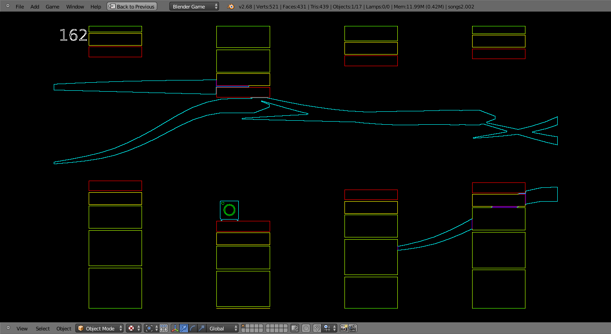
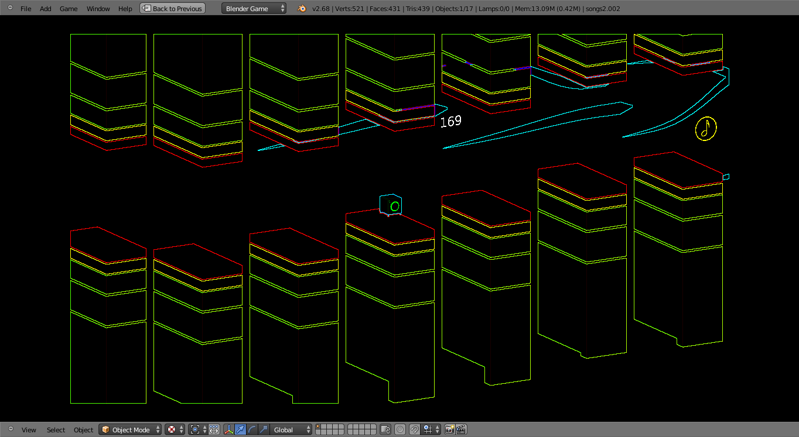

Reverb
======

Reverb is a platformer prototype developed by Rob Steiner and Marcus Tennant.
The prototype was developed in 4 weeks as part of a game of the month competition with the theme of music at Penn State.

Reverb is coded in python and uses the Blender Game Engine. The game begins with the player controlling a speaker in typical 2d view. Platforms designed to look like a stereo's equalizers move towards the player, lasting as long as possible and grabbing coins will net the player points.

In regards to the music theme players are able to load in their own songs. In addition to providing background music the platforms will actually adjust their height based on the waveform of the song, and the speaker will 'thud' along with the song's beat. 

As the player gains more points the world gradually gets more colorful and chaotic. This leads to a crescendo when the player grabs a powerup to transform the gameworld to a 3d perspective. 

Also included are (unimplemented due to time constraints) python files to upload and display highscores for individual songs to an sql database.

